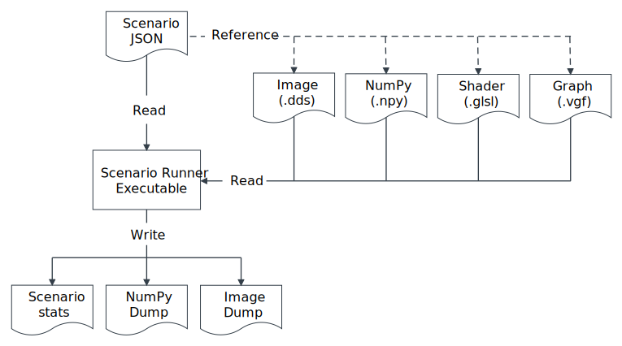

Architecture Overview
=====================

This document is intended for developers who want to understand the architecture
of the Scenario Runner and or work towards contributing to it. This page is organized as follows:

- The Example Execution Flow section provides an overview of the steps that you must take when executing a workload through the Scenario Runner.
- The Logical Architectural Components section presents the main logical components and the utility of each component.

This section describes the end-to-end process of a Scenario Runner execution
and reviews the individual logical modules and their relationship to each other.

Execution flow
--------------

- Test description creation: You must write a test description in JSON format. The test description is also known as the scenario.
  The JSON file lists resources that you need to use and commands that you need to run for the test.
- Input files: You must provide all necessary input files for the test.
- Scenario Runner invocation: You must run the Scenario Runner by providing the
  path to the JSON description file.
- Scenario Runner execution: This loads the test, initializes the resources,
  creates Vulkan® objects, runs the commands and produces output artefacts.

The following image is an example of a high level Scenario Runner execution flow. The image is a data-driven execution flow:

.. figure:: assets/scenario_runner_lifetime.svg
   :align: center
   :width: 30%

You must write a test scenario description in JSON format. The JSON file must list resources
that you need to use and commands that you need to run for the test. If you have specified a "src" attribute for any resources, on start-up, those resources are created and initialized using the data stored in the file pointed by "src" path. Resources with the "dst" attribute
set will write their contents out to the file, but only after execution of the
frame has completed. The exact file format used depends on the resource
type.  The resource also describes some relevant metadata, for example, image
width and height. Each resource has a unique identifier.

Internally, the Scenario Runner completes the following processes:

- Scenario creation: The Runner constructs the scenario from the JSON
  description.
- Compute creation: The Runner object consumes a defined scenario and
  constructs all the underlying Vulkan® objects. For example, memory objects and
  pipelines. The Runner object executes the scenario commands to build up
  the command buffer for execution.
- Execution: The Runner schedules the constructed Compute commands for
  execution. Once completed, an object is returned that contains information about
  the execution, for example, performance numbers that can be queried.

Logical Components
------------------

The following figure shows the major logical components of the Scenario Runner module.

.. figure:: assets/scenario_runner_arch.svg
   :align: center
   :width: 85%

Scenario
^^^^^^^^
``Scenario`` allows you to specify a JSON test description and a context
to run a set of commands using the resources listed in the JSON file.

Data Manager
^^^^^^^^^^^^
The ``Data Manager`` object acts as utility class that helps manage the
resources used by a test. It is responsible for loading the data from files into
memory and provide it to the other classes when needed.

Context
^^^^^^^
The ``Context`` object acts as an aggregate service that manages the
environment under which the different scenarios are executed. It contains
objects and services that are needed for the creation and setup of all the
other individual building blocks, for example, Vulkan® devices.

Objects
^^^^^^^
The Scenario Runner can use different type of Vulkan® objects. For ease, each object is wrapped by dedicated structures that manage their underlying variants. The
different types of objects that are currently supported are ``Buffer``,
``Image``, ``RawData`` and ``Tensor``.

Pipeline
^^^^^^^^
``Pipeline`` acts as a wrapper over the creation of Vulkan® pipelines. It creates
the shader modules, the data graphs, the pipeline layouts and the actual
pipelines that are then registered for execution.

Compute
^^^^^^^
``Compute`` is the object that manages the command pool, the command buffers,
the descriptor sets and all the other relevant structures that are needed for
scheduling the pipelines. Multiple commands can be registered under a command
structure which are aggregated into a single command buffer when ``Compute``
is submitted for execution.

.. note:: The Scenario Runner schedules the commands in order. However, the execution
  and completion of the commands can be out-of-order. For this reason, during the ``Compute`` object construction, the Scenario Runner adds implicit barriers between dispatch
  commands by default.

GLSL Compiler
^^^^^^^^^^^^^^
The ``GLSL Compiler`` object is utility module that uses ``glslang`` to compile
GLSL shaders into SPIR-V™.
